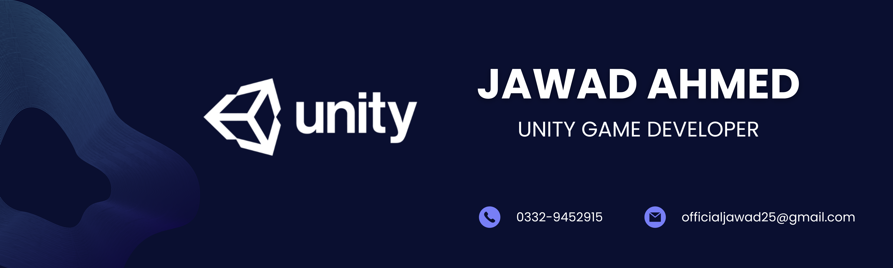
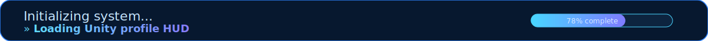
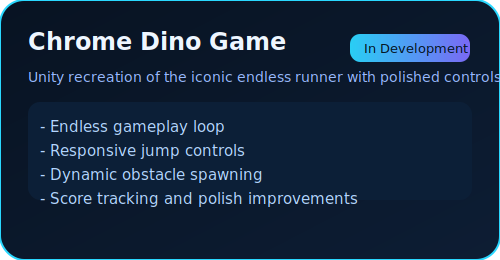
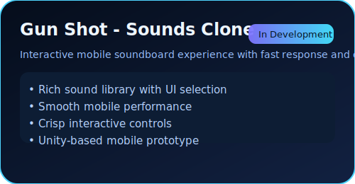
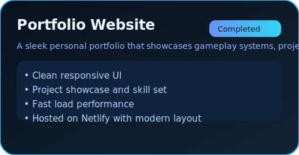
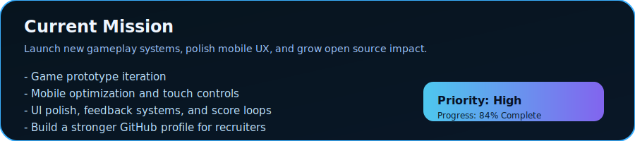
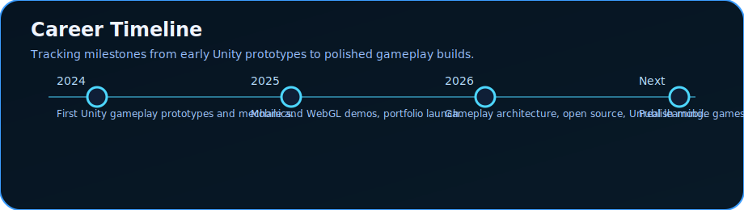
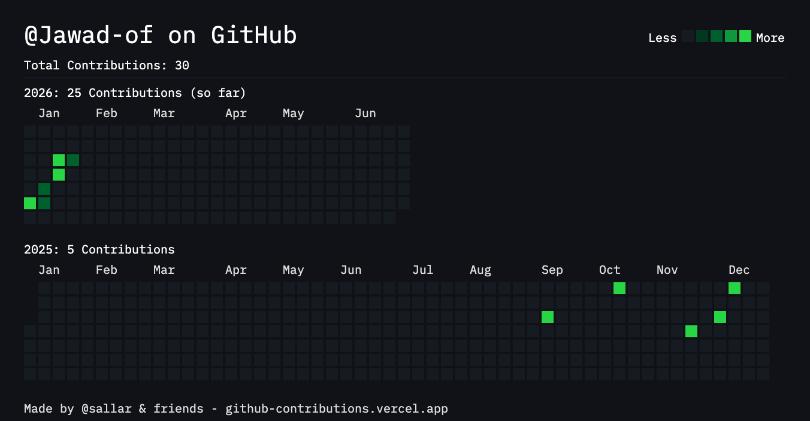
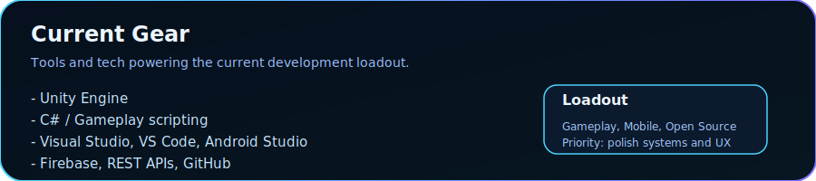

<!-- GitHub Profile README for Jawad Ahmed (Jawad-of) -->

  

  

  
  
  
  

## 🎮 Mission Control

**Jawad Ahmed** — `Jawad-of`

> Building immersive games, crafting interactive experiences, and constantly leveling up as a Unity Developer.

**Current Role:** Student & Unity Game Developer

**Dream Role:** Gameplay Programmer / Unity Developer at a AAA or Indie Game Studio

**Focus:** Unity, Gameplay Programming, Mobile Games, C#, Clean Architecture, Performance Optimization

**Experience:** 1+ Years • Mobile + PC + WebGL • Open to remote roles

**Now building:** polished Unity prototypes, gameplay systems, mobile polish.

---

## 🧠 Skill XP

| Skill | Level |
|---|---|
| Unity | ▓▓▓▓▓▓▓▓▓░ 90% |
| C# | ▓▓▓▓▓▓▓▓▓░ 90% |
| Gameplay Systems | ▓▓▓▓▓▓▓▓▓░ 88% |
| Mobile UX | ▓▓▓▓▓▓▓▓░░ 70% |
| GitHub & Open Source | ▓▓▓▓▓▓▓▓░░ 70% |

---

## 🚀 Core Identity

| Status | Specialty | Ambition |
|---|---|---|
| `Gameplay Dev` | `Unity Builder` | `Remote International Studio` |
| `Player Mechanics` | `Mobile First` | `Open Source Contributor` |
| `Performance Tuning` | `Creative Problem Solver` | `Indie Studio Founder` |

---

## 🛠️ Arsenal

<strong>Game Development</strong>

- Unity
- C#
- Unity UI
- Unity Physics
- Animator
- Particle System
- Tilemap
- Scriptable Objects
- Prefabs
- Scene Management

<strong>Programming</strong>

- C#
- C++
- JavaScript
- HTML5
- CSS3

<strong>Web / Frontend</strong>

- HTML
- CSS
- JavaScript
- React (Learning)

<strong>Mobile / Backend</strong>

- React Native (Learning)
- Node.js
- Express.js
- Firebase
- SQL (Basic)
- REST APIs
- Firebase Authentication
- Firebase Firestore

<strong>Design / Tools</strong>

- Figma
- Photoshop
- Canva
- Visual Studio
- VS Code
- Android Studio
- GitHub Desktop
- Git / GitHub

---

## 🧩 Platforms & Gameplay

| Platform | Status | Notes |
|---|---|---|
| Android | ✅ Active | Mobile-first design
| Windows PC | ✅ Active | Desktop builds & prototypes
| WebGL | ✅ Active | Playable browser demos
| iOS | ✅ Acticve | Mobile build target
| Console | ❌ Learning | Next milestone
| VR / AR | ❌ Learning | Future tech goals |

**Favorite genres:** Endless Runner, FPS, Casual, Puzzle, Simulation, Educational

**Favorite mechanics:** Character Movement, Shooting Systems, Physics, UI Animation, Level Progression, Reward Systems, Touch Controls

---

## 🧪 Featured Builds

  
  
  

### Chrome Dino Game (Unity)
- **Description:** A polished recreation of Google Chrome’s classic Dino adventure in Unity.
- **Core systems:** Endless runner, obstacle spawning, score tracking, responsive input.
- **Tech:** Unity, C#
- **Status:** In Development
- **Next upgrades:** animations, power-ups, sound FX, leaderboard

### Gun Shot - Sounds Clone
- **Description:** Mobile app inspired by classic gun soundboards.
- **Core systems:** multi-sound UI, fluid performance, interactive display.
- **Tech:** Unity, C#
- **Status:** In Development

### Portfolio Website
- **Description:** Personal developer website showcasing gameplay, projects, and growth.
- **Tech:** HTML, CSS, JavaScript
- **Status:** Completed

---

## 📚 Current Roadmap

- Advanced Unity gameplay systems
- Game architecture and clean code design
- C++ and data structures
- Unreal Engine fundamentals
- React Native mobile tooling
- Performance optimization for mobile and WebGL
- Shader Graph and 3D asset pipelines
- Open source contributions and game jam participation

## 🗺️ Quest Log

  

- **Active Mission:** Build polished Unity gameplay prototypes — 84% complete
- **Secondary Target:** Ship mobile game mechanics with touch controls — 68% complete
- **Side Quest:** Turn portfolio into a game-themed project hub — 100% complete
- **Future goal:** Learn Unreal Engine and deploy a cross-platform demo — 34% complete

| Quest | Progress |
|---|---|
| Unity Gameplay Systems | ▓▓▓▓▓▓▓▓▓░ 84% |
| Mobile Game Prototyping | ▓▓▓▓▓▓▓▓░░ 68% |
| Portfolio Launch | ▓▓▓▓▓▓▓▓▓▓ 100% |
| Unreal Engine Learning | ▓▓▓▓▓░░░░░ 34% |

## ⚔️ Boss Battles

| Project | Role | Status |
|---|---|---|
| Chrome Dino Game | Endless runner gameplay | In Development |
| Gun Shot - Sounds Clone | Mobile soundboard UX | In Development |
| Portfolio Website | Personal brand and showcase | Completed |

---

## 🏆 Achievements & Growth

- Started freelancing and building a Fiverr profile
- Growing GitHub profile with incremental contributions
- Planning first game jam entry
- Learning modern Unity patterns and gameplay architecture
- Committed to polished, production-quality projects

## 🎖️ Rewards Wall

- Open source growth: active GitHub contributor
- Design polish: launched portfolio website
- Gameplay focus: building mechanics, input, score loops
- Career aim: land AAA / indie gameplay role

  

## 📈 GitHub Command Center

  

  

## 🔧 Live Dev Stats

  

- **Current Mode:** `Development`
- **Current Learning:** Unreal Engine, Shader Graph, React Native
- **Preferred Tools:** Unity, Visual Studio, VS Code, Android Studio
- **Open roles:** Unity Developer, Gameplay Programmer, Mobile Game Developer

---

## 🌐 Contact & Presence

| Channel | Link |
|---|---|
| GitHub | [github.com/Jawad-of](https://github.com/Jawad-of) |
| LinkedIn | [linkedin.com/in/jawad-ahmed-b0b163350](https://www.linkedin.com/in/jawad-ahmed-b0b163350) |
| Portfolio | [devjawad.netlify.app](https://devjawad.netlify.app/) |
| Twitter/X | [@jawaday_22](https://x.com/jawaday_22) |
| Instagram | [@_jawad.21](https://www.instagram.com/_jawad.21/) |
| Discord | [@jellicious_jd_05388](https://discord.com/channels/@me) |
| Email | `officialjawad25@gmail.com` |
| Itch.io | `https://jawad-of.itch.io/` |

> Recruiters: I’m available for Unity, gameplay, mobile, junior, remote, and freelance roles.

---

## 🎯 Fun Loadout

- **Favorite game:** Minecraft
- **Favorite engine:** Unity
- **Favorite character:** Steve
- **Favorite studio:** Unity Technologies
- **Favorite quote:** “Programs must be written for people to read, and only incidentally for machines to execute.”
- **Favorite language:** C#

**Lifestyle:** Building games one mechanic at a time, staying consistent, solving problems, and shipping playable prototypes.

  

